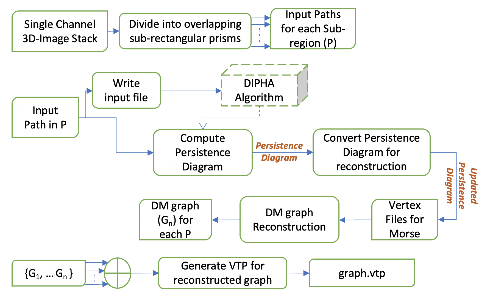

# 3D Discrete Morse Graph Reconstruction Python Package 

## Workflow

## I. Package Description

DiMo3d is a python package meant for executing the discrete Morse graph reconstruction algorithm on 3D imaging data. The package includes functions which allow users to divide the domain into overlapping subregions, compute persistence diagrams of each subregion, generate a discrete Morse graph reconstruction for each subregion, and merge the graphs together into a final graph reconstruction of the full domain.

## II. Installation Instructions

### A. System Requirements:

    Python 3.8.8 (or newer)  
    g++ 9.4.0 (or newer)  
    cmake 3.16.3 (or newer)  

### B. Required Python Libraries

    cv2 - pip install opencv-python ([https://pypi.org/project/opencv-python/](https://pypi.org/project/opencv-python/))
    PIL - pip install pillow ([https://pypi.org/project/Pillow/](https://pypi.org/project/Pillow/))
    vtk - pip install vtk ([https://pypi.org/project/vtk/](https://pypi.org/project/vtk/))

### C. Compiling C++ Code:

**Dipha Persistence Module**

    cd DiMo3d/code/dipha-3d/
    mkdir build
    cd build
    cmake ../
    make

**Discrete Morse Graph Reconstruction Module**

    cd DiMo3d/code/dipha-output/
    g++ ComputeGraphReconstruction.cpp

**Merge Complex Module**

    cd DiMo3d/code/merge/
    g++ ComputeGraphReconstruction.cpp

**Complex Persistence + Discrete Morse Graph Reconstruction Module**

    cd DiMo3d/code/spt_cpp/
    g++ DiMoSC.cpp -I./phat/include -std=c++11 -o spt_cpp

### D. MATLAB scripts:

    cp ./DiMo3d/code/matlab/* ./

## III. DiMo3d methods

### DiMo3d.split_domain(input_dir, output_dir, x_len, y_len, z_len, overlap=5i)

**Description**

Divide the input domain into overlapping sub-rectangular prisms.

    input_dir - path to image stack (individual names should be in lexicographic order)

**Input:**

    Input_dir - path to input image stack
    output_dir - path to dir containing results for each subregion
    x_len - x-axis length of each subregion
    y_len - y-axis length of each subregion
    z_len - z-axis length of each subregion

    overlap - pixel overlap for each axis between adjacent subregions

**Output:**

    Output dir is made containing subdirectories for each region. Each region contains an image stack and its startings x,y,z coordinates  
    Returns nx, ny, nz, and overlap - the x/y/z dimensions of the image stack and the overlap for each axis

**Example:**

    import DiMo3d as dm
    image_stack_dir = "data/image_stack/"
    morse_dir = "results/image_stack_morse/"
    dm.split_domain(image_stack_dir, morse_dir, 64, 64, 64, 5)

### DiMo3d.write_dipha_persistence_input(input_path)

**Description**

Write input file for dipha program used to compute persistence for each subregion

**Input:**

    input_path - input path to the directory containing subregions for which we will need to compute persistence on. This argument should match output_dir of a previous DiMo3d.split_domain call.

**Output:**

    Input file for DIPHA program. A file is written for each subregion.

**Example:**

    import DiMo3d as dm
    image_stack_dir = "data/image_stack/"
    morse_dir = "results/image_stack_morse/"
    dm.split_domain(image_stack_dir, morse_dir, 64, 64, 64, 5)
    dm.write_dipha_persistence_input(morse_dir)

### DiMo3d.compute_dipha_persistence(input_path, threads=1)

**Description**

Compute persistence using DIPHA program for each subregion

**Input:**

    input_path - input path to the directory containing subregions for which we will need to compute persistence on. This argument should be the same as input_path of a previous DiMo3d.write_dipha_persistence_input call
    threads - number of threads used to run in parallel

**Output:**

    Persistence Diagram for each subregion. A file is written for each subregion.

**Example:**

    import DiMo3d as dm
    image_stack_dir = "data/image_stack/"
    morse_dir = "results/image_stack_morse/"
    dm.split_domain(image_stack_dir, morse_dir, 64, 64, 64, 5)  
    dm.write_dipha_persistence_input(morse_dir)
    dm.compute_dipha_persistence(morse_dir)

### DiMo3d.convert_persistence_diagram(input_path, threads=1)

**Description**

Convert the format of the persistence diagram outputted by dipha for each subregion to be used for graph reconstruction

**Input:**

    input_path - input path to directory containing subregions for which we will need to compute persistence on. This argument should be the same as input_path of a previous DiMo3d.compute_persistence call
    threads - number of threads used to run in parallel

**Output:**

    Persistence Diagram for each subregion in format meant for discrete Morse graph reconstruction program. A file is written for each subregion.

**Example:**

    import DiMo3d as dm
    image_stack_dir = "data/image_stack/"
    morse_dir = "results/image_stack_morse/"
    dm.split_domain(image_stack_dir, morse_dir, 64, 64, 64, 5)
    dm.write_dipha_persistence_input(morse_dir)
    dm.compute_dipha_persistence(morse_dir)
    dm.convert_persistence_diagram(morse_dir)

### DiMo3d.write_vertex_files(input_path, threads=1)

**Description**

Write vertex files for each subregion to be used for graph reconstruction

**Input:**

    input_path - input path to directory containing subregions for which we will need to compute persistence on. This argument should be the same as input_path of a previous DiMo3d.convert_persistence_diagram call
    threads - number of threads used to run in parallel

**Output:**

    Text file containing vertex coordinates for each subregion in format meant for discrete Morse graph reconstruction program. A file is written for each subregion.

**Example:**

    import DiMo3d as dm
    image_stack_dir = "data/image_stack/"
    morse_dir = "results/image_stack_morse/"
    dm.split_domain(image_stack_dir, morse_dir, 64, 64, 64, 5)
    dm.write_vertex_file(morse_dir)

### DiMo3d.run_morse(input_path, persistence_threshold, threads=1)

**Description**

Run discrete Morse graph reconstruction on each subregion within input_path directory.

**Input:**

    input_path - input path to directory containing subregions for which we will need to compute persistence on. This argument should be the same as input_path of a previous DiMo3d.convert_persistence_diagram call
    Persistence_threshold - value of persistence threshold parameter used by discrete Morse graph reconstruction algorithm.
    threads - number of threads used to run in parallel

**Output:**

    Vertex and edge file representing the discrete Morse graph reconstruction output. The graph files are stored in a directory for the persistence threshold for each threshold

**Example:**

    import DiMo3d as dm

    image_stack_dir = "data/image_stack/"
    morse_dir = "results/image_stack_morse/"
    dm.split_domain(image_stack_dir, morse_dir, 64, 64, 64, 5)
    dm.write_dipha_persistence_input(morse_dir)
    dm.compute_dipha_persistence(morse_dir)
    dm.convert_persistence_diagram(morse_dir)
    dm.write_vertex_file(morse_dir)
    dm.run_morse(morse_dir, 32)

### DiMo3d.merge(input_path, merge_dir, persistence_threshold, merge_threshold, nx, ny, nz, x_len, y_len, z_len, overlap, threads=1)

**Description**

Perform DM-based hierarchical merging of graphs of subregions. Performed iteratively until a single graph for the entire domain remains.

**Input:**

    input_path - input path to directory containing subregions for which we will need to compute persistence on. This argument should be the same as input_path of a previous DiMo3d.convert_persistence_diagram call
    Merge_dir - directory for merge results will be written to
    Persistence_threshold - value of persistence threshold parameter used by discrete Morse graph reconstruction algorithm.
    merge_threshold - persistence threshold used during DM computation for merges
    nx - size of x axis of original image stack
    ny - size of y axis of original image stack
    nz - size of z axis of original image stack
    x_len - base size of x axis for subregions
    y_len - base size of y axis for subregions
    z_len - base size of z axis for subregions
    overlap - size of overlap on axes between regions
    threads - number of threads used to run in parallel

**Output:**

    Vertex and edge file representing the discrete Morse graph reconstruction output. The graph files are stored in a directory for the persistence threshold for each threshold

**Example:**

    import DiMo3d as dm

    image_stack_dir = "data/image_stack/"
    morse_dir = "results/image_stack_morse/"
    merge_dir = "results/image_stack_merge/"
    dm.split_domain(image_stack_dir, morse_dir, 64, 64, 64, 5)
    dm.write_dipha_persistence_input(morse_dir)
    dm.compute_dipha_persistence(morse_dir)
    dm.convert_persistence_diagram(morse_dir)
    dm.write_vertex_file(morse_dir)
    dm.run_morse(morse_dir, 32)
    dm.merge(morse_dir, merge_dir, 32, 32, 256, 256, 256, 64, 64, 64, 5, 1)

### DiMo3d.write_vtp_graph(vert_filename, edge_filename, output_filename)

**Description**

Convert .txt format graph (vert file and edge file) to .vtp format

**Input:**

    vert_filename - vertex coordinates of graph
    edge_filename - edges of graph
    output_filename - vtp formatted graph file

**Output:**

    A single file (output_filename) written in .vtp format containing the input graph

**Example:**

    import DiMo3d as dm

    image_stack_dir = "data/image_stack/"
    morse_dir = "results/image_stack_morse/"
    dm.split_domain(image_stack_dir, morse_dir, 64, 64, 64, 5)

### DiMo3d.extract_subregion(input_dir, output_dir, x_center, y_center, z_center, x_len, y_len, z_len, threads=1)

**Description**

Extracts a 3D subregion given center coordinates (microns) and size of axes (pixels)

**Input:**

    input_dir - input image stack
    output_dir - directory subregion will be written to
    x_center - x coordinate of center of subregion (microns)
    y_center - y coordinate of center of subregion (microns)
    z_center - z coordinate of center of subregion (microns)
    x_len - x axis length of subregion (pixels)
    y_len - y axis length of subregion (pixels)
    z_len - z axis length of subregion (pixels)
    threads - images handled at a time

**Output:**

    A single file (output_filename) written in .vtp format containing the input graph

**Example:**

    import DiMo3d as dm

    image_stack_dir = "data/image_stack/"
    subregion_dir = "data/subregion/"
    Center = [123, 245, 121]
    dm.extract_subregion(image_stack_dir, subregion_dir, center[0], center[1], center[2], 256, 256, 256)

## IV. Non-Python Code

### 1. C++ programs

### Dipha Persistence Program (./DiMo3d/code/dipha-3d/build/dipha)

**Description**

Compute persistence diagram of given image stack

**Python Function:**

    DiMo3d.compute_dipha_persistence

**Input:**

    input_filename - path to DIPHA input file
    output_filename - filename for traditional DIPHA program persistence diagram
    edge_filename - filename for edge information - vertices, edge type (negative or positive), and persistence value

**Output:**

    Binary file (edge_filename) contained persistence information for all edges

**Example:**

    ./code/dipha-3d/build/dipha --upper_dim 2 /path/to/dipha/input.bin /path/to/dipha/diagram.bin /path/to/dipha/edges.bin

### Discrete Morse Graph Reconstruction Program (./DiMo3d/code/dipha-output/a.out)

**Description:**

Executes discrete Morse graph reconstruction algorithm

**Python Function:**

    DiMo3d.graph_reconstruction

**Input:**

    vert_filename - file contain verts in domain
    dipha_edge_filename - .txt format of edge persistence information
    persistence threshold - persistence threshold for graph reconstruction algorithm
    output_dir - directory where output graph will be written

**Output:**

    Graph (dimo_vert.txt and dimo_edge.txt) written to output_dir

**Example:**

    ./DiMo3d/code/dipha-output/a.out /path/to/vert.txt /path/to/dipha-edges.txt 32 /path/to/results/dir/

### Build Merge Complex

**Description**

Builds the complex across subregions that will be the foundation of the merged output of the region

**Python Function:**

    DiMo3d.merge

**Input:**

    input_dir - directory with results we will need to merge
    output_dir - directory where merge results will be saved
    config_filename - file containing information of regions we will merge
    persistence_threshold - threshold of graphs we wish to merge - this is NOT the persistence threshold used for simplifying DM on the output complex

**Output:**

    A single complex built from up to 8 individual subregions DM graph reconstructions. Will perform another round of DM on this output to get a single graph reconstruction for all subregions

**Example:**

    ./DiMo3d/code/merge/a.out /path/to/morse/dir/ /path/to/merge/dir/ /path/to/merge/dir/merge-config.txt 256

### 2. MATLAB scripts

### parallel_dipha_input.m

**Description**

Creates DIPHA input file for all subregions

**Python Function:**

    DiMo3d.write_dipha_persistence_input

**Input:**

    input_path - input path to directory containing subregions for which we will need to compute persistence on. This argument should be the same as input_path of a previous DiMo3d.compute_persistence call
    valid_filename - filename containing list of valid subregions. This is generated within the python code

**Output:**

    DIPHA input file for each subregion. A subregion's file is written to its results directory

**Example:**

    parallel_dipha_input(/path/to/result/dirs/, /path/to/valid/subdirs.txt)

### DIPHA Persistence Format Conversion

    load_persistence_diagram.m

**Description**

Converts DIPHA persistence diagram to .txt format for use by Discrete Morse Graph Reconstruction program

**Python Function:**

    DiMo3d.convert_persistence_diagram

**Input:**

    input_filename - Persistence diagram output directly from DIPHA program (.bin format)
    output_filename - filename for .txt format of persistence diagram

**Output:**

    Persistence Diagram in .txt format for each subregion

**Example:**

    load_persistence_diagram(/path/to/dipha.edges, /path/to/dipha-edges.txt)

## V. Example Use of Pipeline

    import DiMo3d as dm
    image_stack_dir = "data/image_stack/"
    morse_dir = "results/image_stack_morse/"
    merge_dir = "results/image_stack_merge/"
    nx, ny, nz, overlap = dm.split_domain(image_stack_dir, morse_dir, 64, 64, 64, 5)
    dm.write_dipha_persistence_input(morse_dir)
    dm.compute_dipha_persistence(morse_dir)
    dm.convert_persistence_diagram(morse_dir)
    dm.write_vertex_file(morse_dir)
    dm.graph_reconstruction(morse_dir, 32)
    dm.merge(morse_dir, merge_dir, 32, 32, nx, ny, nz, 64, 64, 64, overlap, 1)

